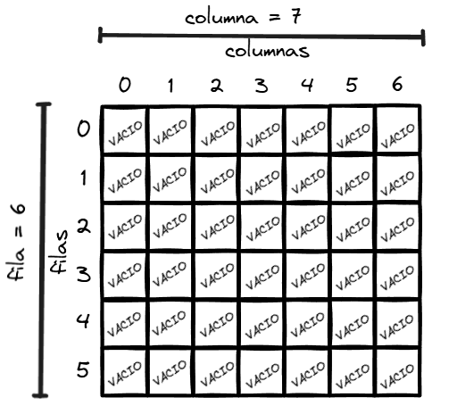
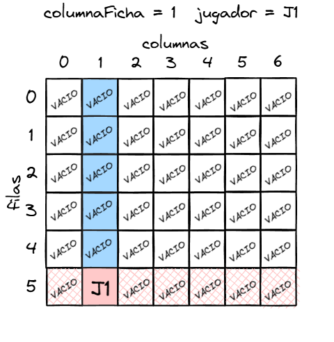
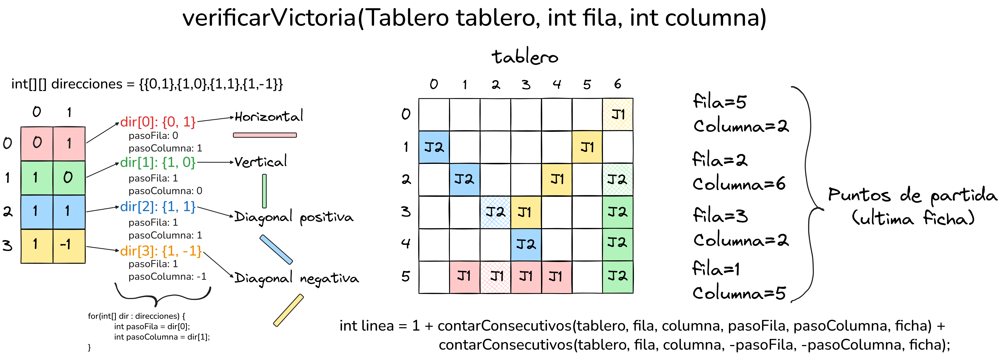

# 🔴🟡 Cuatro en Raya

Este repositorio contiene la implementación del clásico juego de mesa cuatro en raya desarrollado en Java. Este proyecto es el resultado de un trabajo académico, donde el objetivo fue aplicar los conceptos de Programación Orientada a Objetos. El enfoque es construir una estructura lógica muy bien organizada y modular, separando cuidadosamente las reglas del juego de la vista para que el código sea fácil de entender.

El cuatro en raya es un juego de estrategia por turnos para dos personas cuyo objetivo principal consiste en ser el primero en formar una línea continua de cuatro fichas de tu propio color, ya sea en dirección horizontal, vertical o diagonal. Se juega sobre un tablero vertical cuadriculado, tradicionalmente de 7 columnas por 6 filas, que se encuentra vacío al inicio de la partida. En cada turno, los jugadores eligen una columna y dejan caer una de sus fichas desde la parte superior; debido a la gravedad implícita del diseño, la ficha ocupa irremediablemente el espacio libre más bajo disponible en esa columna, lo que obliga a los participantes a planificar sus movimientos con mucha anticipación para bloquear las posibles conexiones del oponente mientras construyen su propia ofensiva. La partida finaliza de forma inmediata cuando un jugador logra alinear sus cuatro fichas, declarándose vencedor, o cuando las 42 celdas del tablero se llenan por completo sin que nadie haya logrado el objetivo, lo que resulta en un empate técnico.

## Indice

* [Arquitectura del Sistema](#arquitectura-del-sistema)
  * [1. Paquete model](#1-paquete-model)
  * [2. Paquete view](#2-paquete-view)
    * [Interfaz por Consola](#interfaz-de-texto)
    * [Interfaz Gráfica](#interfaz-gráfica)
  * [3. Paquete controller](#3-paquete-controller)
  * [4. Paquete ai](#4-paquete-ai)
* [Testing](#testing)
* [Diagrama UML](#diagramas-uml)
---

## Arquitectura del Sistema

El patrón de arquitectura Modelo Vista Controlador (MVC) se utilizó principalmente para garantizar una estricta separación de responsabilidades, logrando que toda la lógica matemática y las reglas del juego (el Modelo) operen de forma totalmente independiente a cómo se muestran en pantalla (la Vista). Esta decisión es fundamental para este proyecto porque permite algo muy poderoso: intercambiar la interfaz de usuario

### 1. Paquete model
Este paquete es el nucleo del juego. Es totalmente independiente de cómo se muestran los datos en pantalla o de si el rival es un humano o una máquina.

**Tablero**: Representa la matriz bidimensional del juego. Implementa la gravedad (las fichas caen hasta la fila más baja disponible) y encapsula el estado de las celdas de forma inmutable hacia el exterior. Maneja programación defensiva lanzando excepciones ante coordenadas inválidas o columnas llenas.

* ***LimpiarTablero()***: Este metodo garantiza que todas las celdas inicien en `EstadoCelda.Vacio`.

    

* ***dejarCaerFicha(int columnaFicha, EstadoCelda jugador)***: Es el motor físico de la clase que permite simular la gravedad del juego iterando la columna especificada desde la base hacia arriba. al momento en que encuentra la primera celda vacía, coloca la ficha del jugador, además incrementa el contador de `fichasColocadas` y retorna la fila exacta donde aterrizó la ficha.

    

* ***estaLleno()***: Determina si el tablero ha alcanzado su capacidad máxima, verificando si el contador `fichasColocadas` es igual al total de celdas `fila * columna`.

* ***obtenerCelda(int indiceFila, int indiceColumna)***: Proporciona un acceso de solo lectura a la posición de un celda específica retornando el estado de esa celda, si el contador o las reglas solicitan coordenadas que no existen, el método bloquea lanzando una excepción.

* ***obtenerFila() y obtenerColumna()***: Permiten exponer las dimensiones inmutables del tablero para que otros componentes sepan cómo iterarlo.

**ReglasJuego**: Actúa como el árbitro. Evalúa matemáticamente el estado del tablero para determinar victorias (búsqueda de 4 fichas consecutivas en direcciones horizontales, verticales y diagonales) o empates. En lugar de escanear todas las celdas de la matriz tras cada turno, esta clase optimiza el proceso evaluando únicamente el epicentro de la acción, que es la última ficha que acaba de caer.

* ***verificarVictoria(Tablero tablero, int fila, int columna)***: Recibe las coordenadas exactas del último movimiento. A partir de esa celda, proyecta vectores en 4 direcciones (horizontal, vertical, diagonal positiva y diagonal negativa) y verifica si las fichas adyacentes corresponden a la última jugada. El método suma la ficha actual más las fichas contiguas en la dirección positiva y negativa del eje, si la línea resultante alcanza la constante `FICHAS_PARA_GANAR` = 4, registra internamente al ganador y retorna true.

    

* ***contarConsecutivos(Tablero tablero, int fila, int columna, int pasoFila, int pasoColumna, EstadoCelda ficha)***: Dado un punto de origen y una dirección vectorial, este método navega celda por celda contando cuántas fichas ininterrumpidas del mismo color existen, deteniéndose en el instante en que choca con los bordes del tablero o encuentra una celda vacía o enemiga.

